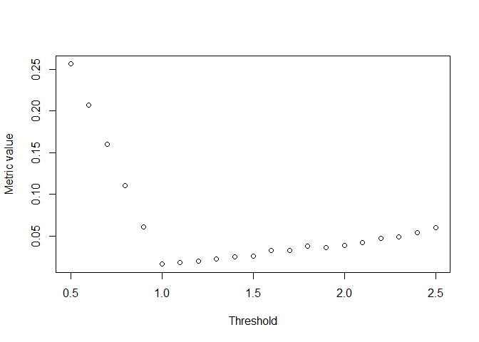
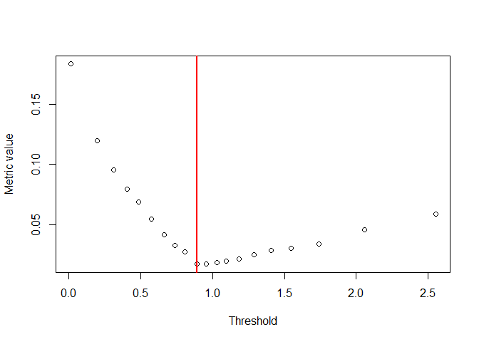

<!-- README.md is generated from README.Rmd. Please edit that file -->

# automated_threshold_selection

<!-- badges: start -->
<!-- badges: end -->

R code used in the preprint “Automated threshold selection and
associated inference uncertainty for univariate extremes” which can be
viewed [here](https://arxiv.org/abs/2310.17999).

## Repository Overview

`thresh_qq_metric.R` contains R code to estimate a constant threshold,
the excesses of which can be closely modelled by a Generalised Pareto
distribution (GPD).

`helper_functions.R` contains functions for the GPD which feed into
`thresh_qq_metric.R`.

`background` contains the R code file to reproduce the parameter
stability plots shown in Section 2 of the main text.

`simulation_study` contains the R code files to reproduce the simulation
study results provided in Section 6 of the main text and Section S:4 of
the supplementary material. These files are still in development.

`application_to_river_flows` contains the R code file to reproduce the
analysis of the River Nidd dataset provided in Section 7 of the main
text.

## Motivation

This method assumes data is independent and identically distributed. The
function `thresh_qq_metric` selects a threshold from the set of proposed
thresholds which allows for excesses to be modelled closely by a GPD
while also accounting for parameter estimation uncertainty.

When selecting a threshold for a particular dataset, there is a
bias-variance trade-off which needs to be addressed. Too low a threshold
is likely to violate the asymptotic basis of the GPD which would lead to
bias in the fit of the model while choosing too high a threshold would
generate very few exceedances with which the model can be estimated,
leading to high parameter uncertainty. Thus, we want to choose as low a
threshold as possible subject to the GPD providing a reasonable fit to
the data. Using simulated data, our method has been shown to directly
tackle this trade-off.

## Method Details

The threshold selection method modifies the approach developed in [Varty
et al. (2021)](https://arxiv.org/abs/2102.00884), for use in a wider
variety of extreme value modelling problems. Namely, the following
adjustments have been made:

    - observations are independent and identically distributed with continuous values,
    - a constant, rather than a variable, threshold is to be selected. 

The method has been shown to perform favourably in this context compared
to competing methods. Further extensions are underway so that the method
may be applied to more complicated settings, such as incorporating
covariate dependence into threshold and/or GPD parameters.

### Mathematical Details

A threshold is selected from a user-specified set of candidate
thresholds by using a quantile-based assessment to quantify the
goodness-of-fit. Specifically, this is done by measuring the expected
deviation from the line of equality on a QQ-plot for each candidate
threshold.

Let $y$ be the sample of excesses of some proposed threshold choice and
$y^{(i)}$ be the $i^{\text{th}}$ bootstrapped sample of $y$. Denote by
$Q_{(i)}(p) : [0,1] \rightarrow \mathbb{R}^+$ the sample quantile
function of $y^{(i)}$ for $i = 1,\dots, k$ while
$M_{(i)}(p) : [0,1] \rightarrow \mathbb{R}^+$ represents the
model/theoretical quantile function based on the parameters fitted to
$y^{(i)}$.

The metric, $d_{(i)}$, measures the disparity between the
$i^{\text{th}}$ (of $k$) bootstrapped sample of threshold excesses and
the relevant quantiles of the fitted GPD model. The discrepancy between
the observed data and fitted model is evaluated at $m$ equally-spaced
evaluation probabilities, $\{p_j = j / (m+1): j = 1,\dots,m\}$. This
results in the following form for the threshold selection metric:

$$d_{(i)} = \frac{1}{m} \sum_{j=1}^{m} |M_{(i)}(p_j) - Q_{(i)}(p_j)|,$$

where
$M_{(i)}(p) = \frac{\hat{\sigma}_i}{\hat{\xi}_i}\left[(1-p)^{-\hat{\xi}_i}-1\right]$
with $(\hat{\sigma}_i, \hat{\xi}_i)$ being the MLEs for the scale and
shape parameters of the GPD fitted to the $i^{\text{th}}$ bootstrapped
excesses $y^{(i)}$.

The expected distance metric $d$, used to select the optimal threshold
is then defined as:

$$d = \frac{1}{k} \sum_{i = 1}^{k} d_{(i)}.$$

## Example Usage

``` r

source("thresh_qq_metric.R")
set.seed(12345)
data_test1 <- rgpd(1000, shape = 0.1, scale=0.5, mu=1)
thresholds1 <- seq(0.5, 2.5, by=0.1)
example1 <- thresh_qq_metric(data_test1, thresh = thresholds1, k=100, m=500)
example1
#> $thresh
#> [1] 1
#> 
#> $par
#> [1] 0.55109279 0.01520654
#> 
#> $num_excess
#> [1] 1000
#> 
#> $dists
#>  [1] 0.25604224 0.20682245 0.16036125 0.11017229 0.06053673 0.01618996
#>  [7] 0.01816384 0.01958013 0.02277792 0.02542442 0.02614856 0.03234347
#> [13] 0.03300269 0.03778108 0.03648707 0.03843098 0.04221289 0.04716345
#> [19] 0.04875931 0.05445418 0.05990898
plot(thresholds1, example1$dists, xlab="Threshold", ylab="Metric value")
abline(v=example1$thresh, col="red", lwd=2)
```

<!-- -->

``` r

set.seed(11111)
test2 <- rgpd(10000, shape = 0.1, scale=0.5)
u <- 1
cens_thr<-u*rbeta(length(test2),1,0.5)
keep <- test2>cens_thr
data_test2 <- test2[keep]
thresholds2 <- quantile(data_test2,seq(0, 0.95, by=0.05))
example2 <- thresh_qq_metric(data_test2,thresh = thresholds2, k=100, m=500)
example2
#> $thresh
#>       45% 
#> 0.8927004 
#> 
#> $par
#> [1] 0.63018743 0.08880792
#> 
#> $num_excess
#> [1] 1868
#> 
#> $dists
#>  [1] 0.18373360 0.11992257 0.09537823 0.07974723 0.06895573 0.05440206
#>  [7] 0.04160290 0.03248768 0.02702868 0.01690360 0.01708816 0.01835272
#> [13] 0.01930755 0.02121212 0.02478849 0.02826063 0.02996687 0.03359736
#> [19] 0.04577595 0.05846480
plot(thresholds2, example2$dists, xlab="Threshold", ylab="Metric value")
abline(v=example2$thresh, col="red", lwd=2)
```

<!-- -->

## Contact

If you have any questions, please contact <c.murphy4@lancaster.ac.uk>.
Please include “Threshold Code” in the subject of the email.
