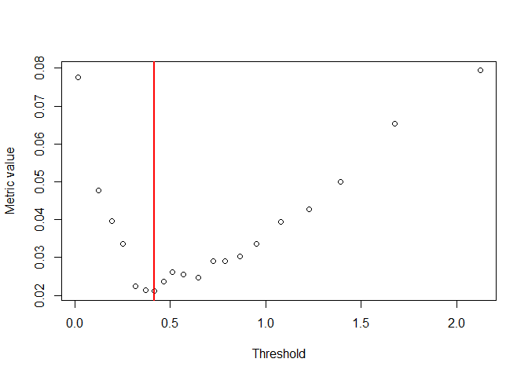

<!-- README.md is generated from README.Rmd. Please edit that file -->

# automated_threshold_selection

<!-- badges: start -->
<!-- badges: end -->

R code used to output figures and tables in the preprint “Automated
threshold selection and associated inference uncertainty for univariate
extremes” which can be viewed [here](https://arxiv.org/abs/2310.17999) .

## Dependencies

To run this code, several R packages are required which may be installed
using the following code:

``` r
    required_pkgs <- c(
        "threshr",
        "evir",
        "tea",
        "Metrics"
        )
        
    install.packages(required_pkgs)
```

## Repository Overview

The structure of the repository follows the main sections of the paper
which include figures/tables. The source code for the methods utilised
in the paper is contained in `/src`.

### `/src`

`eqd.R` contains R code to estimate a constant threshold, the excesses
of which can be closely modelled by a Generalised Pareto distribution
(GPD), utilising the expected quantile discrepancy (EQD) method.

`eqd_***.R` contain variants of the EQD method used for specific
sensitivity experiments and comparisons.

`helper_functions.R` contains functions for the GPD which feed into
`eqd.R`.

`JointMLEFunctions.R` contains R code to implement the Wadsworth (2016)
method for threshold selection. This code was taken from the
supplementary materials of Wadsworth (2016)
[here](https://www.tandfonline.com/doi/abs/10.1080/00401706.2014.998345)
and adapted to count the number of samples where the method fails to
estimate a threshold.

`parameter_stability.R` contains code from `evir::shape` function
adjusted to include bootstrapped confidence intervals in parameter
stability plots.

### `/data`

This section contains all simulated datasets analysed in Section 6 of
the main text and the supplementary material.

### `/Section 2`

`Figure_1_example_parameter_stability_plots.R` contains code to
reproduce the two parameter stability plots shown in Figure_1 in the
main text.

### `/Section 6`

`threshold_selection_cases1-4.R` provides code to generate data (and
save in `/data`) for Cases 1-4, implement the three threshold selection
methods, namely the EQD, Wadsworth (2016) and Northrop et al.(2017), and
save the results in `/output/threshold_selection`.

`RMSE_thresholds_case1-4.R` outputs and saves Table 2 which contains the
root-mean-squared errors (RMSEs) of the selected thresholds for each of
the compared methods.

`RMSE_quantiles_case1-4.R` outputs and saves Table 3 which contains the
RMSEs of several high quantile estimates using the estimated thresholds
for each of the compared methods.

`quantile_coverage_case4.R` employs Algorithm 1 and 2 (detailed in
Section 5 of the main text) and saves the respective sets of
bootstrapped quantile estimates for a range of exceedance probabilities.
Confidence intervals are then calculated and the coverage of true
quantiles is assessed and outputted into Table S.19 (a subset of which
is shown in Table 4) which is saved in `/output/tables`.

`threshold_selection_gaussian.R`, `RMSE_quantiles_gaussian.R` and
`quantile_coverage_gaussian.R` contain code to perform threshold
selection, calculate RMSEs of quantile estimates and implement
Algorithms 1 and 2 to assess coverage of the true quantiles as above but
for Gaussian samples, resulting in Table 5 and Table S.20 (a subset of
which is shown in Table 6).

### `/Section 7`

`Table_7_River_Nidd_dataset_selected_thresholds.R` provides code to
perform threshold selection on the River Nidd dataset for each of the
methods using a range of different candidate threshold grids and output
Table 7 and save to `/output/tables`.

`Figure_2_River_Nidd_analysis.R` performs further analysis on the River
Nidd dataset. Using the estimated threshold from the EQD method, a
QQ-plot is constructed with 95% tolerance bounds and a return level plot
is outputted which utilises Algorithm 1 and 2, showing two different
sets of 95% confidence intervals. Both plots are outputted and saved as
Figure 2 in `/output/Nidd_analysis`.

### `/output`

`/parameter_stability` provides the outputted parameter stability plots
for Figure 1 of the main text and Figure S.1 in the supplementary
material.

`/threshold_selection` contains the estimated thresholds for each of the
compared methods after implementation on each of the replicated samples
from Cases 1-4 and the Gaussian cases. Results are also included for the
Danielsson (2001) and Danielsson et al. (2019) methods which are only
analysed in the supplementary material.

`/coverage` contains the sets of bootstrapped quantile estimates for the
Case 4 and Gaussian samples outputted from Algorithm 1 and 2.

`/tables` provides the outputted RMSEs, bias and variance results for
estimated thresholds and subsequent quantile estimates, as well as
coverage probabilities, corresponding to each of the tables shown in
Section 6 and 7 of the main paper and in the supplementary material.

`/Nidd_analysis` contains the outputted plot corresponding to Figure 2
in Section 7 of the main text which shows a QQ-plot and return level
plot for the River Nidd dataset.

A summary table showing a mapping of source files to outputted
figures/tables in the main text is given below.

### Summary

| Figure/Table | Section |           Code to generate Figure/Table            |                Dependencies                |
|:------------:|:-------:|:--------------------------------------------------:|:------------------------------------------:|
|   Figure 1   |    2    |   `Figure_1_example_parameter_stability_plots.R`   |          `parameter_stability.R`           |
|   Table 2    |    6    |            `RMSE_thresholds_case1-4.R`             |      `threshold_selection_cases1-4.R`      |
|   Table 3    |    6    |             `RMSE_quantiles_case1-4.R`             |      `threshold_selection_cases1-4.R`      |
|   Table 4    |    6    |            `quantile_coverage_case4.R`             | `threshold_selection_cases1-4.R` , `eqd.R` |
|   Table 5    |    6    |            `RMSE_quantiles_gaussian.R`             |      `threshold_selection_gaussian.R`      |
|   Table 6    |    6    |           `quantile_coverage_gaussian.R`           | `threshold_selection_gaussian.R`, `eqd.R`  |
|   Table 7    |    7    | `Table_7_River_Nidd_dataset_selected_thresholds.R` |       `eqd.R`, `JointMLEFunctions.R`       |
|   Figure 2   |    7    |          `Figure_2_River_Nidd_analysis.R`          |                  `eqd.R`                   |

## Example Usage

``` r

source("src/eqd.R")
set.seed(12345)
data_test1 <- rgpd(1000, shape = 0.1, scale=0.5, mu=1)
thresholds1 <- seq(0.5, 2.5, by=0.1)
example1 <- eqd(data_test1, thresh = thresholds1, k=100, m=500)
example1
#> $thresh
#> [1] 1
#> 
#> $par
#> [1] 0.55109279 0.01520654
#> 
#> $num_excess
#> [1] 1000
#> 
#> $dists
#>  [1] 0.25604224 0.20682245 0.16036125 0.11017229 0.06053673 0.01618996
#>  [7] 0.01816384 0.01958013 0.02277792 0.02542442 0.02614856 0.03234347
#> [13] 0.03300269 0.03778108 0.03648707 0.03843098 0.04221289 0.04716345
#> [19] 0.04875931 0.05445418 0.05990898
plot(thresholds1, example1$dists, xlab="Threshold", ylab="Metric value")
abline(v=example1$thresh, col="red", lwd=2)
```

<!-- -->

``` r

set.seed(11111)
data_all <- rgpd(4000, shape=0.1, scale=0.5, mu=0)
cens_thr<-rbeta(length(data_all),1,2)
data_above <- sample(data_all[data_all > 1], 279, replace=FALSE)
data_below <- sample(data_all[data_all > cens_thr & data_all <= 1], 721, replace = FALSE)
data_test2 <- c(data_below, data_above)
thresholds2 <- quantile(data_test2,seq(0, 0.95, by=0.05))
example2 <- eqd(data_test2,thresh = thresholds2, k=100, m=500)
example2
#> $thresh
#>       30% 
#> 0.4169537 
#> 
#> $par
#> [1] 0.644593096 0.007900157
#> 
#> $num_excess
#> [1] 700
#> 
#> $dists
#>  [1] 0.07763146 0.04768825 0.03959962 0.03359459 0.02229891 0.02134857
#>  [7] 0.02107620 0.02364104 0.02604049 0.02559984 0.02475472 0.02912688
#> [13] 0.02909661 0.03018644 0.03360872 0.03933678 0.04280008 0.04991603
#> [19] 0.06532955 0.07936680
plot(thresholds2, example2$dists, xlab="Threshold", ylab="Metric value")
abline(v=example2$thresh, col="red", lwd=2)
```

<!-- -->

### Contact

If you have questions, please contact <c.murphy4@lancaser.ac.uk>. Please
include “Threshold code” in the subject of the email.
